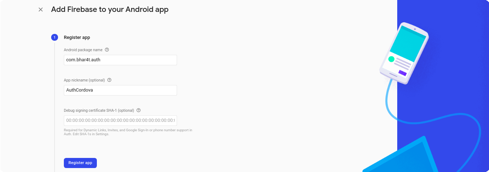
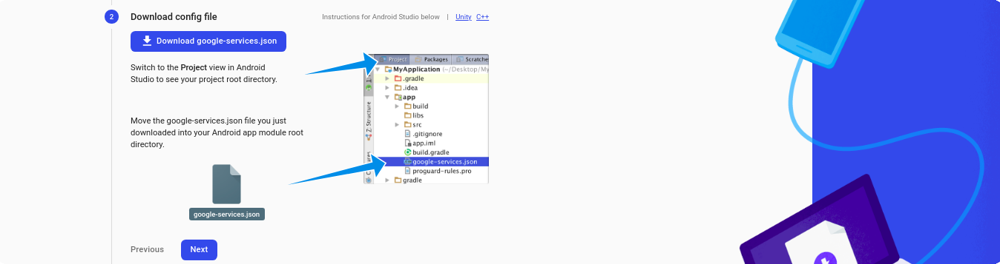
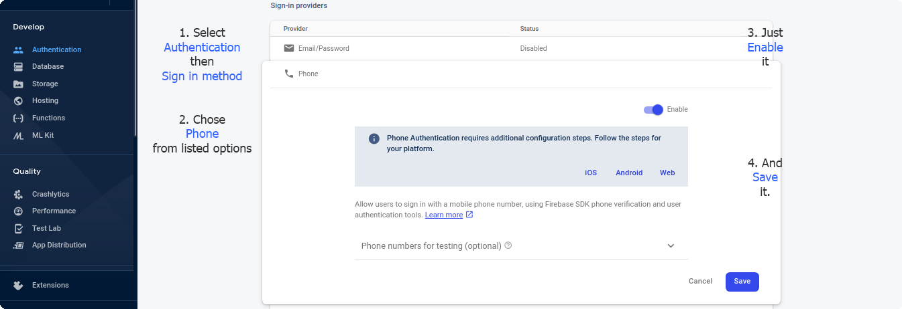

# Cordova with Firebase phone authentication without Captcha

There is two way to implement Firebase Phone Authentication in the Cordova application. first, by using Cordova plugin another is using `firebase-js-sdk`.

If you go with the first option, you’ll have to find a Cordova plugin which also provides all the Firebase services otherwise, your Cordova plugin authenticated user will not work with `firebase-js-sdk` services eg. you’ll unable to perform database CRUD operations.

And, if you go with the second option, you have to configure a lot of things related to Captcha/reCaptcha. You can see [here](https://firebase.google.com/docs/auth/web/phone-auth) in the official document.

Don’t worry we are not implementing all these kinds of stuff, Here we’re going to use `firebase-js-sdk` with Firebase Phone Authentication without Captcha and ReactJS application in a simple way, You don’t need to learn the whole React for this but if you want to use React with Cordova, you can get many examples on the [Medium](https://medium.com/) or [Google](https://google.com/).

Before going to hand dirty on code, we have to create an Android project in [Firebase console](https://console.firebase.google.com/).

Step I: First I have to register my new Android application **name** and **package name** in Firebase console. cause you won’t have an option for the Cordova application.



You’ll see the third option while registering the app as **Debug signing certificate SHA-1**. It seems optional but because we’re creating authentication based application I’ll recommend you generate those certificates. [You can generate debug certificates by following it](https://developers.google.com/android/guides/client-auth) or by the following command default password is `android`

```
// Ubuntu

keytool -list -v -alias keystore -keystore ~/.android/debug.keystore


// Windows

keytool -list -v -alias androiddebugkey -keystore %USERPROFILE%\.android\debug.keystore
```

Generated certificate output will be like below:

```
Certificate fingerprint: SHA1: DA:39:A3:EE:5E:6B:4B:0D:32:55:BF:EF:95:60:18:90:AF:D8:07:09
```

Just copy the **SHA1** fingerprint and paste in the third input field **Debug signing certificate SHA-1**. after then click to **Register App.**

Step II: The below screen will appear after click on the **Register App** button.



Click on the **Download google-service.json,** you’ll have a JSON file, place it on the root of your project. and, remember you need to specify in `config.xml` for `google-service.json` so, Cordova will place the copied file inside _platforms/android/app_ directory while generating the app.

```xml
<platform name="android">
    <resource-file
      src="google-services.json"
      target="app/google-services.json"
    />
</platform>
```

after this click on Next, Next… Finally, you’ve set up an Android project in Firebase.

tep III: Now, you have to enable the Phone Authentication for your newly registered Android application.

1.  Select **_Authentication_** from **_Develop_** option.
2.  Choose **_Sign-in method_**
3.  Choose **_Phone_**
4.  Just **_Enable_** it from the right upper toggle button
5.  **_Save_** it or if you don’t want to block from firebase while testing, you can add a random phone number and OTP for testing purposes then **_Save_** it.



We’ve finished the configuration in Firebase console, Now we’ve to look upon our local project.

---

In this project, You will see the major role of two dependencies. because we’re not going to use Captcha/reCaptcha I’ll use a Cordova plugin for generating verification id for phone numbers. and we’re going to verify that verification id and OTP by using `firebase-js-sdk`. Add these dependencies by below commands:

1. Cordova plugin [cordova-plugin-firebase-authentication](https://github.com/chemerisuk/cordova-plugin-firebase-authentication)

```
cordova plugin add cordova-plugin-firebase-authentication --save
```

2. Add `[firebase-js-sdk](https://www.npmjs.com/package/firebase)` in your package:

```
// using npm
npm i firebase

// or yarn
yarn add firebase
```

3. Configure your `firebase-js-sdk` to already created projects on Firebase console. you need to create a file as I’ve created in `src/store.js` and use this boilerplate code for configuration.

```js
import firebase from "firebase";
import "firebase/firestore";

import "firebase/auth";const _config_ = firebase.initializeApp({
  apiKey: '<your-api-key>',
  authDomain: '<your-auth-domain>',
  databaseURL: '<your-database-url>',
  projectId: '<your-cloud-firestore-project>',
  storageBucket: '<your-storage-bucket>',
  messagingSenderId: '<your-sender-id>'
  appId: '<key>:<key>:<android>:<your-sender-id>',
});

const auth = firebase.auth();
const db = config.firestore();

export { auth, firebase };
```

You can get configuration details in `google-service.json` for firebase app initialization or if you feel the hassle to get those keys/configurations detail in one place, Add a web app in the same project of Firebase console where we added the Android app before. you’ll have exactly the same configuration detail as mentioned above in **_Project Settings > Web Apps > Firebase SDK snippet_** copy and paste the config in your project.

Here I have exported instances `auth,` `firebase` now I can use it wherever I want.

Its time to design the login page, Here we’ll talk about code snippet, not about UI but in the [**Github repository**](https://github.com/bhar4t/auth-cordova)**,** you’ll get the full code.

4. I have created a `Login.js` page, where I have to register a listener method for an authenticated user. You can register your listener in React’s lifecycle method `[static getDerivedStateFromProps()](https://reactjs.org/docs/react-component.html#static-getderivedstatefromprops)` and, if you’re using React Hooks you can register it in `[useEffect](https://reactjs.org/docs/hooks-reference.html#useeffect)`.

```js
import { auth, firebase } from "./store";
```

Whenever a user logged in or log out listener method will be invoked automatically, I have registered listener method from `firebase-js-sdk` of `auth`. You’ll see a listener method in added Cordova plugin too but we’re not going to use it because we have decided to work with `firebase-js-sdk`.

```js
auth.onAuthStateChanged((authUser) => {
  if (authUser) {
    // Pass authUser
  } else {
    // Handle null
  }
});
```

Create a function, that will starts the phone number verification process for the given phone number. for this use the Cordova plugin method inside `verifyPhoneNumber` which takes two parameters first phone number along with country code and second is `timeout` [milliseconds] is the maximum amount of time you are willing to wait for SMS auto-retrieval to be completed by the library. The maximum allowed value is 2 minutes. Use 0 to disable SMS-auto-retrieval. If you specify a positive value less than 30 seconds, the library will default to 30 seconds.

```js
cordova.plugins.firebase.auth
  .verifyPhoneNumber("+91" + phoneNumber, 0)
  .then((verification_id) => {
    // Pass verification_id
  });
```

After invoking `verifyPhoneNumber` OTP will be sent to given mobile number. then the last process to be required is to verify the OTP and generated verification id for this again we’re going to use a function `signInAndRetrieveDataWithCredential()` from `firebase-js-sdk`.

```js
const credential = firebase.auth.PhoneAuthProvider.credential(
  verification_id,
  otp
);

auth
  .signInAndRetrieveDataWithCredential(credential)
  .then((result) => {
    console.log(result);
  })
  .catch((error) => {
    // Handle error
  });
```

Finished! If OTP and, verification_id verify successfully automatically your registered listener `onAuthStateChanged()` will be invoked.

Thank You!

References:

1.  [https://github.com/firebase/firebase-js-sdk](https://github.com/firebase/firebase-js-sdk)
2.  [https://github.com/chemerisuk/cordova-plugin-firebase-authentication](https://github.com/chemerisuk/cordova-plugin-firebase-authentication)
3.  [https://cordova.apache.org/#getstarted](https://cordova.apache.org/#getstarted)
4.  [https://reactjs.org/](https://reactjs.org/)

Read On [Medium](https://bhar4t.medium.com/cordova-with-firebase-phone-authentication-without-captcha-6663427920d9), or [Article](https://bhar4t.com/articles/Cordova-with-Firebase-Phone-Authentication-without-Captcha-and-reCaptcha)
